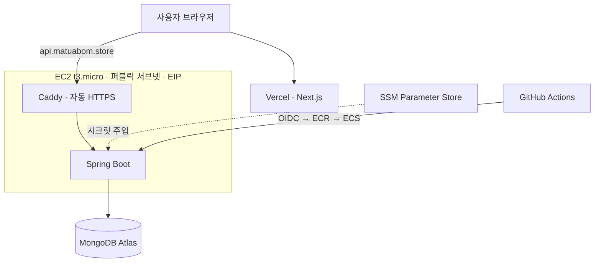

<div align="center">

# ☁️ 맞춰봄 Infra

**맞춰봄 백엔드를 프리티어 범위에서 운영하기 위한 AWS 인프라 (Terraform)**


</div>

## 아키텍처



| 구성 요소 | 내용 |
|---|---|
| 컴퓨트 | EC2 t3.micro 1대, ECS(EC2 launch type) 태스크 1개에 `be`(Spring Boot)와 `caddy` 컨테이너 |
| HTTPS | Caddy가 Let's Encrypt 인증서를 자동 발급·갱신 (로드밸런서 없음) |
| 네트워크 | VPC + 퍼블릭 서브넷 2개, Elastic IP |
| 시크릿 | SSM Parameter Store(SecureString) → 태스크 정의 `secrets`로 주입 |
| DNS | Route 53 `api.matuabom.store` → EIP, `matuabom.store` → Vercel |
| CI/CD | [BE 레포](https://github.com/Dahllyuhrah-Dahllyuhk/BE)에서 GitHub OIDC로 ECR push와 ECS 재배포 (장기 AWS 키 없음) |

## 설계 원칙

사용자가 적은 서비스를 **프리티어 안에서** 운영하는 것을 목표로, 비싼 관리형 구성 요소를 쓰지 않았습니다.

| 쓰지 않은 것 | 대신 쓴 것 | 포기한 것 |
|---|---|---|
| ALB | EC2 위의 Caddy | 여러 인스턴스로의 부하 분산 |
| NAT Gateway | 퍼블릭 서브넷 + EIP | 프라이빗 서브넷 격리 |
| Fargate | ECS on EC2 (t3.micro) | 서버 관리 부담 없는 실행 환경 |
| RDS · ElastiCache | MongoDB Atlas 무료 티어 | 관리형 DB의 성능 보장 |
| Secrets Manager | SSM Parameter Store (Standard) | 자동 교체 기능 |

## 배포

인프라 생성, SSM 시크릿 주입, 첫 배포 절차는 [terraform/README.md](./terraform/README.md)를 참고하세요.

```bash
cd terraform
terraform init
terraform plan
terraform apply
```

애플리케이션 배포는 BE 레포의 `develop` 브랜치에 push하면 GitHub Actions가 자동으로 수행합니다.

## 디렉터리

```
.
├── terraform/   # 현재 인프라 (ECS on EC2, Caddy, SSM, Route 53, OIDC)
└── legacy/      # 2025년 EC2 + docker-compose 구성 (참고용, 사용하지 않음)
```

> `legacy/`에는 2026-07 재배포 이전의 구성(docker-compose, nginx, Prometheus·Grafana, Logstash, k6 부하 테스트 스크립트)과 당시 배포 워크플로가 보관되어 있습니다.
